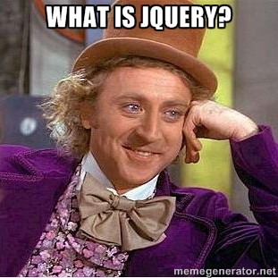
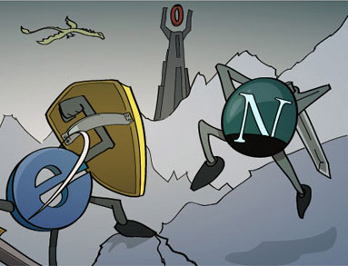
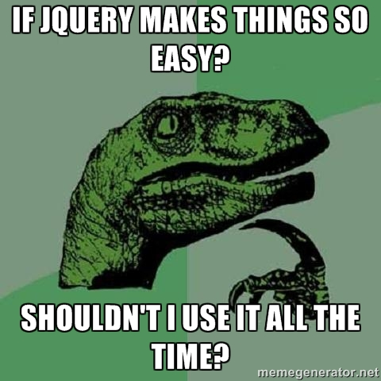
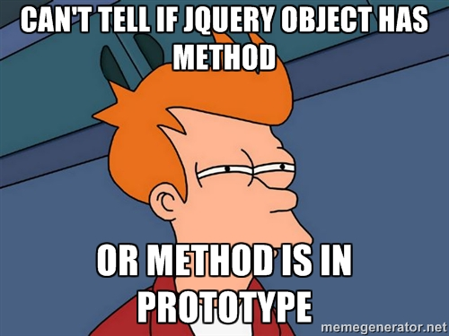

title: You Might Not Need jQuery
author:
  name: Andre Dublin
  twitter: andredublin
  url: andredublin.github.io
theme: jdan/cleaver-retro
output: index.html

--

# CharlestonJS Group

--

### Who is this guy?

    

--

### You Might Not Need jQuery

##### What we will be covering

* What is jQuery
* Why is jQuery great
* Why is jQuery not so great
* How jQuery may have outlived its potential
* Some alternatives to jQuery
* Feed your mind

--

### What is jQuery

--

### What is jQuery

jQuery helps designers and developers into the browser environment.

--

# A brief history of javascript

--

### The browser wars!

--

### The browser wars!

  

--

### The browser wars!

  

--

### The browser wars!

--

### Why is jQuery great

--

### Why is jQuery great

jQuery is awesome because of its easy learning curve, compared to other popular libraries like Prototype, Mootools, DOJO, YUI, or Scriptaculous.

It offered us a simple way to get the elements we wanted and build client-side javascript software to our hearts content.

Helps to get things done quickly without much knowledge of native javascript and the Web/DOM API.

--

### Why is jQuery not so great

--

### Why is jQuery not so great

Doesn’t actually teach you javascript.

Hides a lot of neat things that you can do with vanilla javascript.

Projects that may require advanced javascript knowledge.

--

### How jQuery might of outlived its potential

jQuery might not be available for your project.

New javascript libraries and frameworks offer functionality that jQuery cannot.

Doesn't provide structure to our front-end projects like some frameworks offer.

--

### Some alternatives to basic jQuery functionality

Browser engines now have query selector functions that give you the same exact functionality as jQuery, but minus the jQuery object wrapper.

The Sizzle, Qwery or Zepto selector engines.

Ecmascript 5, Ecmascript 6.

Angularjs, Backbone, React, Vue.

--

### Feed your mind ( books )

DOM Enlightenment

Javascript the Good Parts

Javascript the Definitive Guide

Javascript Patterns

--

### Feed your mind ( links )

[Eloquent Javascript](http://eloquentjavascript.net/)

[Mozilla Developer Network Javascript Reference](https://developer.mozilla.org/en-US/docs/Web/JavaScript/Reference)

[You Might Not Need jQuery](http://youmightnotneedjquery.com/)

[jQuery Source](https://github.com/jquery/jquery)

--

### Thank you

