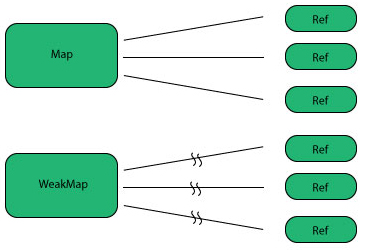

title: Intro to ECMAScript 6
author:
  name: Andre Dublin
  twitter: andredublin
  url: andredublin.github.io
theme: jdan/cleaver-retro
output: index.html

--

# Intro to ECMAScript 6

--

### JavaScript is everywhere!

* Where: browsers, servers, devices.
* Problem: Used for much more than it was created for.
* How: Making it better with the ES5 and ES6 standards.

--

### This talk

* Background.
* Goals.
* Features for nodejs.
* Features for the future.
* When/How can I use it?

--

### Background

* TC39 (Ecma Technical Committee 39): the committee evolving JavaScript.
  * Members: companies ( all major browser vendors etc. ).
  * Meetgins attended by employees and invited experts.

--

### Background

* ECMAScript: the offical name of the language
  * Versions: ECMAScript 5 is short for "ECMAScript Language Specification, Edition 5"
* JavaScript:
  * Informally, the language.
  * Formally, one implementation of ECMAScript.
* ECMAScript Harmony:
  * Improvements after ECMAScript 5 (ECMAScript 6 and 7)

--

### Goals

* Make JavaScript better.
* For complex applications.
* For libraries.
* As a target for code generators.

--

### Features for nodejs

--

### Block scoping

    function foobar(x, y) {
      if (x > y) {
        var tmp = x;
        x = y;
        y = tmp;
      }
      console.log(tmp === x); // true

      return [x,y];
    }

--

### Block scoping

    function foobar(x, y) {
      if (x > y) {
        let tmp = x;
        x = y;
        y = tmp;
      }
      console.log(tmp === x); // ReferenceError: tmp is not defined

      return [x,y];
    }

--

### Block scoping

    var login = (function foobar() {
      var privateKey = Math.random();

      return function(password) {
        return password === privateKey;
      };
    }());

    login();

--

### Block scoping

    function foobar() {
      let privateKey = Math.random();

      var login = function(password) {
        return password === privateKey;
      };
    }

    foobar();

--

### Block scoping

    function foobar() { console.log('I am outside!'); }
    (function () {
      if(false) {
        // What should happen with this redeclaration?
        function foobar() { console.log('I am inside!'); }
      }

      foobar();
    }());

--

### Block scoping

    const a = 'You shall remain constant!';

    a = 'I wanna be free!'; // SyntaxError: Assignment to constant variable

--

### Block scoping

    {
        let a;
        let a; // SyntaxError: Variable 'a' has already been declared
    }

--

### Arrows

    // Expression bodies
    var odds = evens.map(v => v + 1);
    var nums = evens.map((v, i) => v + i);

--

### Arrows

    // Statement bodies
    nums.forEach(v => {
      if (v % 5 === 0)
        fives.push(v);
    });

--

### Arrows

    // Lexical this
    var bob = {
      _name: "Bob",
      _friends: [],
      printFriends() {
        this._friends.forEach(f =>
          console.log(this._name + " knows " + f)
        );
      }
    }

--

### Classes

    class SkinnedMesh extends THREE.Mesh {
      constructor(geometry, materials) {
        super(geometry, materials);

        this.idMatrix = SkinnedMesh.defaultMatrix();
        this.bones = [];
        this.boneMatrices = [];
      }

      update(camera) {
        super.update();
      }

      static defaultMatrix() {
        return new THREE.Matrix4();
      }
    }

--

### Enhanced Object Literals

    var obj = {
      // __proto__
      __proto__: theProtoObj,
      // Shorthand for ‘handler: handler’
      handler,
      // Methods
      toString() {
        // Super calls
        return "d " + super.toString();
      },
      // Computed (dynamic) property names
      [ 'prop_' + (() => 42)() ]: 42
    };

--

### Template Strings

    // Basic literal string creation
    `In JavaScript '\n' is a line-feed.`

    // Multiline strings
    `In JavaScript this is
    not legal.`

    // Construct a DOM query
    var name = "Bob", time = "today";
    `Hello ${name}, how are you ${time}?`

    // Construct an HTTP request prefix is used to interpret the replacements and construction
    GET`http://foo.org/bar?a=${a}&b=${b}
        Content-Type: application/json
        X-Credentials: ${credentials}
        { "foo": ${foo},
          "bar": ${bar}}`(myOnReadyStateChangeHandler);

--

### Destructing

    // list matching
    var [a, , b] = [1,2,3];

    // object matching
    var { op: a, lhs: { op: b }, rhs: c } = getASTNode()

    // object matching shorthand
    // binds `op`, `lhs` and `rhs` in scope
    var {op, lhs, rhs} = getASTNode()

    // Can be used in parameter position
    function g({name: x}) {
      console.log(x);
    }
    g({name: 5})

--

### Destructing

    // Fail-soft destructuring
    var [a] = [];
    a === undefined;

    // Fail-soft destructuring with defaults
    var [a = 1] = [];
    a === 1;

--

# Default + Rest + Spread Parameters & Arguments

--

### Default

    function f(x, y=12) {
      // y is 12 if not passed (or passed as undefined)
      return x + y;
    }
    f(3) == 15

--

### Rest

    function f(x, ...y) {
      // y is an Array
      return x * y.length;
    }
    f(3, "hello", true) == 6

--

### Spread

    function f(x, y, z) {
      return x + y + z;
    }
    // Pass each elem of array as argument
    f(...[1,2,3]) == 6

--

### Iterators

    let fibonacci = {
      [Symbol.iterator]() {
        let pre = 0, cur = 1;
        return {
          next() {
            [pre, cur] = [cur, pre + cur];
            return { done: false, value: cur }
          }
        }
      }
    }

    for (var n of fibonacci) {
      // truncate the sequence at 1000
      if (n > 1000)
        break;
      print(n);
    }

--

### Generators

    function* argumentsGenerator() {
      for (let i = 0; i < arguments.length; i += 1) {
        yield arguments[i];
      }
    }

    var argumentsIterator = argumentsGenerator('a', 'b', 'c');

    // Prints "a b c"
    console.log(
      argumentsIterator.next().value,
      argumentsIterator.next().value,
      argumentsIterator.next().value
    );

--

### Generators

    // Prints "a", "b", "c"
    for (let value of argumentsIterator) {
      console.log(value);
    }

--

### Generators

    function* fibonacci() {
        let a = 0, b = 1;

        while(true) {
          yield a;
          [a, b] = [b, a + b];
        }
    }

    // Enumerates the Fibonacci numbers
    for (let value of fibonacci()) {
      console.log(value);
    }

--

### Generators

    // task.js example
    spawn(function*() {
      var data = yield $.ajax(url);
        $('#result').html(data);
        var status = $('#status').html('Download complete.');
        yield status.fadeIn().promise();
        yield sleep(2000);
        status.fadeOut();
    });

    try {
      let result = spwan().next().value; // yields the promise object
      spawn().next();
      // do something with result
    } catch {
      // clean up
    }

--

### Generators

    let delegatedIterator = (function* () {
        yield 'Hello!';
        yield 'Bye!';
    }());

    let delegatingIterator = (function* () {
        yield 'Greetings!';
        yield* delegatedIterator;
        yield 'Ok, bye.';
    }());

    // Prints "Greetings!", "Hello!", "Bye!", "Ok, bye."
    for(let value of delegatingIterator) {
      console.log(value);
    }

--

### Comprehensions

    // Array comprehensions
    var results = [
      for(c of customers)
        if (c.city == "Seattle")
          { name: c.name, age: c.age }
    ]

    // Generator comprehensions
    var results = (
      for(c of customers)
        if (c.city == "Seattle")
          { name: c.name, age: c.age }
    )

--

### Unicode

    // same as ES5.1
    "𠮷".length == 2

    // new RegExp behaviour, opt-in ‘u’
    "𠮷".match(/./u)[0].length == 2

    // new form
    "\u{20BB7}"=="𠮷"=="\uD842\uDFB7"

    // new String ops
    "𠮷".codePointAt(0) == 0x20BB7

    // for-of iterates code points
    for(var c of "𠮷") {
      console.log(c);
    }

--

### Modules

    // lib/math.js
    export function sum(x, y) {
      return x + y;
    }
    export var pi = 3.141593;

    // app.js
    module math from "lib/math";
    alert("2π = " + math.sum(math.pi, math.pi));

    // otherApp.js
    import {sum, pi} from "lib/math";
    alert("2π = " + sum(pi, pi));

--

### Modules

    // lib/mathplusplus.js
    export * from "lib/math";
    export var e = 2.71828182846;
    export default function(x) {
      return Math.exp(x);
    }

    // app.js
    module math from "lib/mathplusplus";
    import exp from "lib/mathplusplus";
    alert("2π = " + exp(math.pi, math.e));

--

### Subclassing

    // Pseudo-code of Array
    class Array {
        constructor(...args) { /* ... */ }
        static [Symbol.create]() {
            // Install special [[DefineOwnProperty]]
            // to magically update 'length'
        }
    }

    // User code of Array subclass
    class MyArray extends Array {
        constructor(...args) { super(...args); }
    }

--

### Subclassing

    // Two-phase 'new':
    // 1) Call @@create to allocate object
    // 2) Invoke constructor on new instance
    var arr = new MyArray();
    arr[1] = 12;
    arr.length == 2

--

### Maps and Sets

    const people = [
      {name: 'Douglas Crockford'},
      {name: 'Remy Sharp'},
      {name: 'Gary Bernhardt'}
    ];

    let books = new Map();

    books.set(people[0], 'JavaScript the Good Parts');
    books.set(people[1], 'Introduction to HTML5');
    books.set(people[2], 'Wat?');

--

### Maps and Sets

    let colorsArray = ['red', 'orange', 'green', 'blue', 'red', 'green'];

    let colors = new Set();
    colorsArray.forEach(function (color) {
      colors.add(color);
    });
    console.log(colors); // 'red', 'orange', 'green', 'blue'

--

### Weakmap

    let weakMap = WeakMap();

    // This is effectively a noop, the key-value pair can immediately be garbage collected
    weakMap.set({}, 'noise');

--

### Weakmap

    // Expose user metadata to the rest of the program
    let userMetadata = WeakMap();

    server.on('userConnect', function (user) {
      userMetadata.set(user, { connectionTime: Date.now() });

      server.on('userDisconnect', function () {
        // Do stuff with `user` and discard of it, automatically discarding `userMetadata`
      });
    });

--

### Weakmap

--

### Weakmap

    let weakMap = WeakMap();

    // TypeError: Invalid value used as weak map key
    weakMap.set('example string literal', 0);

--

### Proxies

    // Proxying a normal object
    var target = {};
    var handler = {
      get: function (receiver, name) {
        return `Hello, ${name}!`;
      }
    };

    var p = new Proxy(target, handler);
    p.world === 'Hello, world!';

--

### Proxies

    // Proxying a function object
    var target = function () { return 'I am the target'; };
    var handler = {
      apply: function (receiver, ...args) {
        return 'I am the proxy';
      }
    };

    var p = new Proxy(target, handler);
    p() === 'I am the proxy';

--

### Symbols

    var a = {};
    a['debugSymbol'] = 'This property value is identified by a symbol';

    let a = {};
    let debugSymbol = Symbol();

    a[debugSymbol] = 'This property value is identified by a symbol';

--

### Tail Calls

    function factorial(n, acc = 1) {
        'use strict';
        if (n <= 1) return acc;
        return factorial(n - 1, n * acc);
    }

    // Stack overflow in most implementations today,
    // but safe on arbitrary inputs in eS6
    factorial(100000)

--

### Promises

    function timeout(duration = 0) {
        return new Promise((resolve, reject) => {
            setTimeout(resolve, duration);
        })
    }

    var p = timeout(1000).then(() => {
        return timeout(2000);
    }).then(() => {
        throw new Error("hmm");
    }).catch(err => {
        return Promise.all([timeout(100), timeout(200)]);
    })

--

# Thank you

Fin

